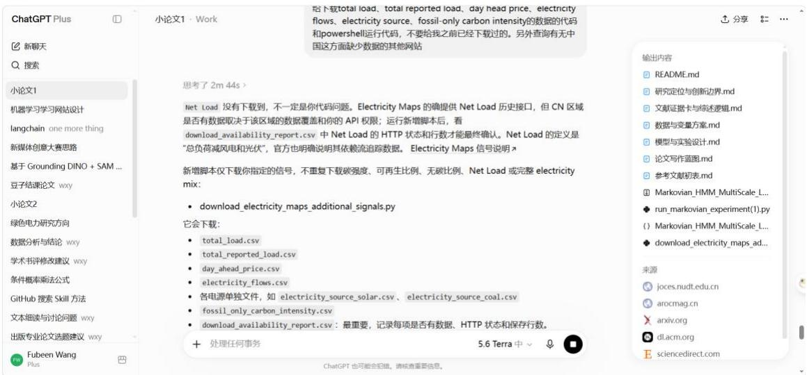

## Llm 是一个大模型用来去调用知识回答问题

Embedding 是向量转换工具很强，但是是一个中介，需要更好的发射器

<table><tr><td rowspan=1 colspan=1>Chain</td><td rowspan=1 colspan=1>我现在正在做的</td></tr><tr><td rowspan=1 colspan=1>Graph</td><td rowspan=1 colspan=1>差不多东西</td></tr><tr><td rowspan=1 colspan=1>Chatgpt</td><td rowspan=1 colspan=1>一个很强大的网站，有任何问题都可以问</td></tr><tr><td rowspan=1 colspan=1>Codex</td><td rowspan=1 colspan=1>自主运行相关任务，省事省时间</td></tr></table>

<table><tr><td colspan="1" rowspan="1">文献名字</td><td colspan="1" rowspan="1">研究内容概括</td></tr><tr><td colspan="1" rowspan="1">Carbon-Aware Computing for Datacenters</td><td colspan="1" rowspan="1">提出数据中心碳感知计算管理系统，以日前碳强度预测形成可用计算容量曲线；是本文“预测到容量”转换的直接依据。</td></tr><tr><td colspan="1" rowspan="1">Measuring the Carbon Intensity of AI in CloudInstances</td><td colspan="1" rowspan="1">建立AI软件运行碳排放核算框架，说明时段与区域碳强度差异会显著影响 AI运行排放。</td></tr><tr><td colspan="1" rowspan="1">Carbon-Aware Computing for Data Centers withProbabilistic Performance Guarantees</td><td colspan="1" rowspan="1">研究含不确定性和性能保证的数据中心碳感知负荷整形，支持本文加入风险缓冲与预测误差评估。</td></tr><tr><td colspan="1" rowspan="1">Markovian RNN</td><td colspan="1" rowspan="1">以HMM状态概率控制不同循环单元的状态转移，为现有MarkovianHMM—LSTM软门控提供方法依据。</td></tr><tr><td colspan="1" rowspan="1">A New Approach to the Economic Analysis ofNonstationary Time Series</td><td colspan="1" rowspan="1">提出马尔可夫状态转换建模思路，为电网碳强度的非平稳状态划分提供理论基础。</td></tr><tr><td colspan="1" rowspan="1">Modeling Long- and Short-Term Temporal Patternswith Deep Neural Networks</td><td colspan="1" rowspan="1">同时建模短期局部依赖与长期周期模式，支持24小时短期分支和168小时长期周期分支。</td></tr><tr><td colspan="1" rowspan="1">Towards the Systematic Reporting of the Energyand Carbon Footprints of Machine Learning</td><td colspan="1" rowspan="1">提出机器学习能源与碳足迹的系统报告框架，支持本文明确单位算力能耗、情景参数与边界。</td></tr><tr><td colspan="1" rowspan="1">Energy and Policy Considerations for Deep</td><td colspan="1" rowspan="1">揭示深度学习训练的能源与碳成本，说明面向AI负荷的碳预算研</td></tr><tr><td colspan="1" rowspan="1">Learning in NLP</td><td colspan="1" rowspan="1">究具有现实意义。</td></tr><tr><td colspan="1" rowspan="1">Energy and AI</td><td colspan="1" rowspan="1">汇总AI相关能源需求与电力系统影响，支撑研究背景中AI负荷增长与电力需求压力的宏观论述。</td></tr><tr><td colspan="1" rowspan="1">Electricity Maps API Documentation</td><td colspan="1" rowspan="1">说明碳强度、负荷、清洁电力比例等小时级信号的定义与获取方式，是本文电网侧数据说明的依据。</td></tr></table>