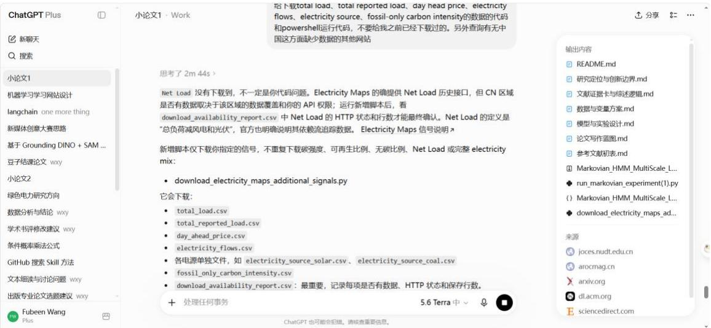

## Llm 是一个大模型用来去调用知识回答问题

## Embedding 是向量转换工具很强，但是是一个中介，需要更好的发射器

<table><tr><td rowspan=1 colspan=1>Chain</td><td rowspan=1 colspan=1>我现在正在做的</td></tr><tr><td rowspan=1 colspan=1>Graph</td><td rowspan=1 colspan=1>差不多东西</td></tr><tr><td rowspan=1 colspan=1>Chatgpt</td><td rowspan=1 colspan=1>一个很强大的网站，有任何问题都可以问</td></tr><tr><td rowspan=1 colspan=1>Codex</td><td rowspan=1 colspan=1>自主运行相关任务，省事省时间</td></tr></table>

